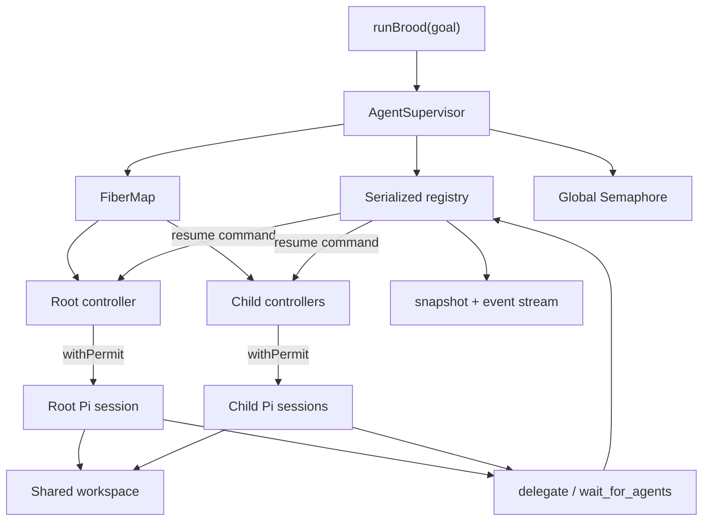

# Brood v1 implementation plan

Status: v1 implemented; frozen contract retained as the implementation and review record
Date: 2026-08-07
Audience: implementers and reviewers

Implementation verification: the deterministic offline suite covers the domain,
tool protocol, registry races, semaphore/controller lifecycle, real Pi adapter,
CLI parsing, and an actual Pi-driven root → child → grandchild swarm at global
concurrency one. The opt-in live-provider smoke test is present but intentionally
not part of normal CI. `pnpm typecheck`, `pnpm test`, `pnpm check`, and
`pnpm build` are the release gates.

This document specifies the first implementation of Brood: an Effect-native,
supervised multi-agent harness built on Pi. It is intentionally more precise
than a roadmap. The concurrency, suspension, transcript, failure, and lifetime
rules below are correctness requirements.

## 1. Goal

Brood accepts one goal and starts a root agent. Every agent can delegate work to
agents with the same tools, workspace access, profile catalogue, and delegation
capability. Agents may use different operator-configured model profiles. They
share one filesystem workspace and may create files there for durable
coordination; Brood does not assign worktrees, artifacts, or file ownership.

Brood must provide:

- recursive delegation with no distinction in capability between root and child;
- run-scoped heterogeneous model selection through named, operator-defined
  profiles;
- one global concurrency limit across the entire swarm, at every depth;
- cheap logical agents that do not consume concurrency while waiting;
- transcript-safe suspension and resumption when an agent waits for other agents;
- supervision, interruption, terminal outcome tracking, live monitoring, and
  orderly resource cleanup;
- typed failures at Effect boundaries, with no await that can hang because a
  controller died silently;
- one persistent Pi session per logical agent for the lifetime of that agent.

## 2. Fixed v1 decisions

### 2.1 Logical agents and active runs are different resources

A logical agent is a controller fiber, registry entry with a single pending
command slot, terminal outcome, and lazily acquired Pi session. A global slot
covers initial Pi session startup and each active `PiAgent.run`. Queued agents,
open-but-idle sessions, and agents waiting on dependencies do not hold slots.

Waiting is never implemented by awaiting children inside a Pi tool callback.
The current Pi turn ends cleanly, the permit is released, and the controller
waits without a permit. This prevents the classic pool deadlock in which every
permit is held by a parent waiting for children that cannot start.

### 2.2 Provenance and dependencies are separate

`spawnedBy` records why an agent exists and produces an observability tree. It
does not imply ownership, joining, or cascading cancellation. The wait graph is
dynamic, but v1 waits may target only the caller's own direct children. The wait
graph is therefore a subset of the spawn tree and acyclic by construction. V1
does not implement global agent discovery, foreign-agent references, or cycle
detection.

### 2.3 One creation tool, one synchronization tool

`delegate` is the only way an agent creates agents. It accepts a non-empty batch,
including a one-element batch, and defaults to waiting for the whole batch.

```ts
delegate({
  tasks: [
    { name: "api", goal: "Investigate the API", profile: "researcher" },
    { name: "tests", goal: "Design the test strategy" },
  ],
  wait: "all", // optional; defaults to "all"
});
```

The only values of `wait` are `"all"` and `"none"`. Subset and wait-any modes
are not part of v1.

`wait_for_agents` is retained for dependencies that cannot be expressed by the
same `delegate` call: direct children created in an earlier turn or a subset of
the caller's children selected after resumption.

```ts
wait_for_agents({
  children: ["api", "tests"],
});
```

### 2.4 Names are scoped and never rebound

Child names are unique for the spawning agent's entire lifetime, including
after the child terminates. Names resolve only among the caller's direct
children. The registry retains name tombstones until Brood shuts down.

`delegate` validates the complete batch before mutation. Empty tasks, duplicate
names within the batch, or collision with a historic child name reject the whole
batch. There is no "most recent wins" behavior.

### 2.5 Orphans run to completion

A parent completing, failing, or being interrupted does not cancel its children.
They are globally supervised and continue to terminal outcomes. Normal Brood
completion captures the root outcome, drains all admitted agents, and then
returns or fails with the captured root outcome. External shutdown or
interruption closes the supervisor scope and interrupts every controller.

### 2.6 Process restart recovery is out of scope

Pi JSONL sessions provide transcripts, not swarm recovery. The v1 registry,
wait intents, name indexes, terminal deferreds, and pending commands are
in-memory. A process restart does not reconstruct a running swarm. Session files
are useful for audit and later recovery work, but recovery is not claimed in v1.

### 2.7 Direct mid-run messaging is out of scope

At the low-level Pi agent loop, `shouldStopAfterTurn` is a hard exit: tool results
are complete, the hook emits `agent_end`, and neither steering nor follow-up is
polled afterward. The unverified hazard is one layer up in `AgentSession`, where
session-level `steer`/`followUp` queues may start another loop after the first
loop returns. V1 therefore does not expose `session.steer`, `session.followUp`,
or a direct message tool, and treats an unexpected queued message after a
suspension turn as a run failure. Agents coordinate through the shared
workspace, `delegate`, dependency outcomes delivered on resume, and their own Pi
transcripts. Steering can be added only after Brood owns a durable message stream
and can drain/replay Pi's session queue across suspension.

### 2.8 Model profiles are immutable run-scoped routing

Brood defines no built-in model profiles. Each run receives one non-empty named
catalogue, one `defaultProfile`, and an optional `rootProfile`. The catalogue is
decoded, resolved, defensively copied, and frozen when the run layer starts; it
is never reloaded or mutated during that run. Freezing applies to Brood-owned
catalogue wrappers and public metadata, not Pi's runtime-owned `Model` object.

The root uses `rootProfile ?? defaultProfile`. Every delegated task at every
depth uses its explicit profile or the run's `defaultProfile`; omission never
inherits the parent's profile. The effective `ProfileName` is stored during
agent admission and cannot change during suspension, resumption, or session
reuse. Profiles change only the Pi model and thinking level. They do not change
tools, workspace access, delegation capability, or the global semaphore.

Every agent may explicitly select every configured profile. This is routing,
not authorization or cost enforcement: `maxAgents` and `maxConcurrency` bound
population and active runs, not tokens or currency. Profile names and bounded
descriptions are model-visible prompt configuration; credential material must
never be placed in them. Pi JSONL does not persist tool schemas or descriptions.

## 3. Explicit non-goals and accepted limits

- No worktrees, artifact ownership, file leases, or merge protocol.
- No distributed/networked supervisor; v1 is one Node process.
- No permission or sandbox layer beyond the environment in which Brood runs.
- No durable swarm recovery after process failure.
- No direct agent-to-agent steering or chat protocol.
- No profile inheritance, mid-session model switching, fallback chains,
  per-profile concurrency pools, delegatable-profile ACLs, or hard spend budget.
  Any agent can deliberately fan out on the most expensive configured profile.
- No compile-time configuration construction helper. Programmatic and file/env
  configuration share the one runtime validation path in section 12. If Brood
  becomes an embedded library with third-party programmatic callers, a
  `keyof`-constrained pre-decode identity helper may be added in front of that
  same pipeline, never as a bypass.
- No depth limit in v1. Total admitted agents are bounded by configurable
  `maxAgents` (default `128`, including the root). The check lives inside atomic
  batch admission, so exceeding it rejects the whole batch with a model-visible
  `DelegateRejected`; it never creates a partial fan-out.
- No automatic retry at the supervisor boundary. Pi already owns provider retry
  and compaction recovery. Brood must not duplicate retry without an explicit,
  idempotent policy.
- No live provider calls in the default test suite.

## 4. Upstream versions and local Effect rules

Initial implementation must pin exact versions and commit the lockfile:

- Node: `>=22.19.0` (the current development machine is newer);
- `@earendil-works/pi-coding-agent`: `0.84.1`;
- `@earendil-works/pi-agent-core`: `0.84.1`, pinned directly for the loop types
  and Phase 0 characterization test;
- `@earendil-works/pi-ai`: `0.84.1`, pinned directly because Brood consumes its
  `Model` and thinking-level helpers;
- `effect`: `4.0.0-beta.105`;
- `@effect/vitest`: `4.0.0-beta.105`;
- TypeScript `5.9.3`, `@types/node` `24.12.4`, Vitest `4.1.10`, and TypeBox
  `1.3.7`;
- Oxfmt `0.62.0` and Oxlint `1.77.0`.

Do not use version ranges for the Effect beta or Pi during v1 development.
Re-evaluate upgrades intentionally because both integration surfaces are moving.

The Effect v4 guide copied from
[`kitlangton/skills`](./vendor/kitlangton-effect-skill/UPSTREAM.md) is the local
default. The pinned package source wins if the guide is stale. Known local
clarifications are:

- use `Context.Service`, `Layer.effect`, `Effect.fn`, scoped fibers, `FiberMap`,
  `Semaphore.make`, and `semaphore.withPermit`;
- use `Schema.TaggedError` with the pinned beta; the copied guide's
  `Schema.TaggedErrorClass` examples are stale;
- use `Schema.TaggedError` and Schema at actual tool/disk/public boundaries, not
  for every internal scheduler error or for runtime records containing queues,
  deferreds, fibers, or Pi objects; internal failures may use ordinary tagged
  classes or `Data.TaggedError`;
- do not adopt the guide's unusual self-exporting module namespace pattern for
  this small codebase;
- use deterministic Effect tests with `Deferred`, `Queue`, `Latch`, `Ref`, and
  `TestClock`; never synchronize tests with arbitrary sleeps;
- use `Config` and test `ConfigProvider` values rather than reading
  `process.env` inside application services.
- keep `skipLibCheck: true`, matching Pi's own build, because the published Pi
  provider declarations do not independently pass full dependency checking.
  Brood's included source and tests remain strict; the exact finding is recorded
  in the [Phase 0 compatibility record](./docs/phase-0-pi-compatibility.md).

## 5. Architecture



Only two public application services are needed initially:

```ts
interface PiAdapterApi {
  readonly open: (config: PiAgentConfig) => Effect.Effect<PiAgent, PiOpenError, Scope.Scope>;
}

interface AgentSupervisorApi {
  readonly startRoot: (goal: Goal) => Effect.Effect<AgentId, RootStartError>;

  readonly awaitOutcome: (id: AgentId) => Effect.Effect<AgentOutcome, UnknownAgent>;

  readonly drain: Effect.Effect<DrainReport>;
  readonly interrupt: (id: AgentId, source: "cli" | "api") => Effect.Effect<void, UnknownAgent>;
  readonly snapshot: Effect.Effect<ReadonlyArray<AgentSnapshot>>;
  readonly events: Stream.Stream<SupervisorEvent>;
}
```

The registry is a private implementation object inside the supervisor layer,
not a third public service. Tool handlers receive a narrow, already-provided
port rather than depending on `AgentSupervisor` through the Effect environment.
This avoids a layer cycle: the supervisor opens Pi sessions, and those sessions
contain tools that call back into supervisor operations.

One supervisor layer instance owns one Brood run and accepts exactly one root.
After registry quiescence it accepts no new work. This makes
`nonterminalCount === 0` a stable drain condition rather than a transient gap
before an unrelated external root is admitted.

Runtime composition creates the shared Pi `ModelRuntime`, compiles the run's
profile catalogue once, and closes over the resulting immutable value in the
supervisor and tool factories. The full resolved catalogue is not another
public service, `Ref`, or mutable registry. `PiAdapter.open` continues to accept
one concrete `PiAgentConfig`; it does not look up names or read run configuration.

## 6. Domain types

Boundary data uses Effect Schema. Internal control-flow algebras use
`Data.TaggedEnum` or ordinary discriminated unions. Runtime records remain plain
TypeScript types.

### 6.1 Identifiers and inputs

```ts
type AgentId = string & Brand.Brand<"AgentId">;
type BatchId = string & Brand.Brand<"BatchId">;
type AgentName = string & Brand.Brand<"AgentName">;
type ProfileName = string & Brand.Brand<"ProfileName">;
type ToolInvocationId = string & Brand.Brand<"ToolInvocationId">;
type WaitId = string & Brand.Brand<"WaitId">;

interface DelegatedTask {
  readonly name: AgentName;
  readonly goal: string;
  readonly profile?: ProfileName;
}
```

Names are trimmed and constrained to a documented, model-friendly character set
such as `[A-Za-z0-9][A-Za-z0-9_-]{0,63}`. IDs are opaque and generated by Brood;
tests inject a deterministic generator. Profile names use the same character
shape but are exact, case-sensitive configuration keys: do not trim,
case-normalize, or fuzzily match them.

Pi custom-tool parameter schemas use TypeBox because Pi requires it. String
enums such as `wait` must use `StringEnum` from `@earendil-works/pi-ai`, not
`Type.Union` of string literals, because the latter is not accepted consistently
by every supported provider. Tool implementations immediately normalize and
validate those values with the Effect domain schemas.
Unknown persisted/control payloads are decoded with
`Schema.decodeUnknownEffect`.

### 6.2 Run-scoped model profiles

```ts
import type { ModelThinkingLevel as PiModelThinkingLevel } from "@earendil-works/pi-ai";

export type ModelThinkingLevel = PiModelThinkingLevel;

export const THINKING_LEVELS = [
  "off",
  "minimal",
  "low",
  "medium",
  "high",
  "xhigh",
  "max",
] as const satisfies ReadonlyArray<ModelThinkingLevel>;

const _exhaustiveThinkingLevels: Record<ModelThinkingLevel, true> = {
  off: true,
  minimal: true,
  low: true,
  medium: true,
  high: true,
  xhigh: true,
  max: true,
};

interface ModelProfile {
  readonly description: string;
  readonly provider: string;
  readonly model: string;
  readonly thinkingLevel?: ModelThinkingLevel;
}

interface ProfilesConfigInput {
  readonly defaultProfile: string;
  readonly rootProfile?: string;
  readonly profiles: Readonly<Record<string, ModelProfile>>;
}

interface ProfilesConfig {
  readonly defaultProfile: ProfileName;
  readonly rootProfile?: ProfileName;
  readonly profiles: Readonly<Record<string, ModelProfile>>;
}

interface PublicModelProfile {
  readonly name: ProfileName;
  readonly provider: string;
  readonly model: string;
  readonly thinkingLevel: ModelThinkingLevel;
}

interface ResolvedModelProfile {
  readonly public: PublicModelProfile;
  readonly description: string;
  readonly model: Model<Api>; // private; never serialized
}

interface PiAgentConfig {
  readonly agentId: AgentId;
  readonly profile: ResolvedModelProfile;
  // workspace, state/session paths, tools, and timeouts omitted here
}
```

Decode `profiles` as a string-keyed record and then validate every key with the
`ProfileName` schema. Do not rely on a constrained `Schema.Record` key to reject
invalid object keys. Build the Effect thinking-level schema from
`THINKING_LEVELS`. The `satisfies` check rejects removed/renamed upstream values
and `_exhaustiveThinkingLevels` rejects newly added ones, so Pi union drift fails
compilation rather than silently changing configuration validity. Phase 0 must
record the pinned package's exact exported type name rather than guessing it.
The catalogue compiler runs once per Brood layer build and:

1. requires at least one profile and existing `defaultProfile` and
   `rootProfile`, when supplied;
2. bounds descriptions to `512` Unicode code points, classifies them as
   model-visible prompt text, and rejects empty provider/model strings;
3. resolves every exact, case-sensitive `(provider, model)` pair with the shared
   `ModelRuntime.getModel`, builds the public projection from the returned
   model's canonical `provider` and `id`, and never uses fuzzy CLI or model-scope
   resolvers;
4. normalizes an omitted thinking level from Pi's pinned `"medium"` default and
   computes the effective value with `clampThinkingLevel`;
5. rejects an explicitly requested level when clamping would change it, while an
   omitted level deliberately accepts the model-supported clamp of `"medium"`;
6. sorts profile names for stable schemas/help text and builds one immutable
   `HashMap<ProfileName, ResolvedModelProfile>` plus resolved default/root
   entries.

After canonical rendering, reject a catalogue whose complete profile-help block
exceeds configured `maxProfileHelpChars` (default `4_000`) Unicode code points.
The block includes every name, description, and the default/no-inheritance
explanation, so this also bounds the runtime enum/tool-schema prompt footprint
without adding per-profile policy. Tool definitions accompany every provider
request, making this a per-turn, per-agent prompt tax rather than a one-time
startup cost.

Catalogue compilation verifies local model resolution, not the success of a
future provider request. V1 does not perform network/authentication preflight for
every unused profile. Missing or expired credentials discovered by the selected
agent's first prompt remain `PiRunError`. The original config object is never
retained, so caller mutation cannot affect an active run.

Only `PublicModelProfile` may cross a serialization or monitoring boundary. The
private resolved value may flow from runtime composition into `PiAdapter`, but
Pi's full `Model` contains fields such as base URLs, arbitrary headers, and
compatibility options that may contain secrets and must never be spread into
output. Descriptions are shown only in agent tool help; they are excluded from
snapshots and events.

### 6.3 Pi run outcome

```ts
type PiRunOutcome =
  | {
      readonly _tag: "Completed";
      readonly result: PiRunResult;
    }
  | {
      readonly _tag: "Suspended";
    };

interface PiRunResult {
  readonly finalText: string;
  readonly finalMessageId: string | undefined;
  readonly stopReason: "stop";
}

interface PiAgent {
  readonly sessionId: string;
  readonly events: Stream.Stream<PiSessionEvent>;
  readonly run: (prompt: string) => Effect.Effect<PiRunOutcome, PiRunError | PiProtocolError>;
}
```

The supervisor guarantees one caller per session. `PiAgent.run` enforces that
invariant with an in-flight `Ref`: concurrent entry dies immediately with a
`ConcurrentPiRunDefect` and never queues or touches the active prompt. The flag
is acquired with `Effect.acquireUseRelease`: the atomic check/set completes with
its release registered before interruption can be observed, the Pi run in the
use region remains interruptible, and release resets the flag. A rejected
concurrent caller never acquires the resource or runs its release. Serializing
impossible concurrent traffic would hide a supervisor bug and introduce
cancellation semantics Brood does not need.

### 6.4 Result and resume payloads

`PiRunResult` is adapter-local and may temporarily contain the complete final
assistant text. Before it enters the registry or another prompt, the controller
normalizes it into a bounded `AgentResult`:

```ts
interface AgentResult {
  readonly agentId: AgentId;
  readonly sessionId: string;
  readonly summary: string;
  readonly truncated: boolean;
  readonly originalCharacterCount: number;
}

interface DrainReport {
  readonly timedOut: boolean;
  readonly interruptedAgentIds: ReadonlyArray<AgentId>;
  readonly terminalAgentCount: number;
}

interface BroodResult {
  readonly root: AgentResult;
  readonly drain: DrainReport;
}

type DependencyOutcome =
  | {
      readonly _tag: "Completed";
      readonly agentId: AgentId;
      readonly name: AgentName;
      readonly result: AgentResult;
    }
  | {
      readonly _tag: "Failed";
      readonly agentId: AgentId;
      readonly name: AgentName;
      readonly code: string;
      readonly message: string;
    }
  | {
      readonly _tag: "Interrupted";
      readonly agentId: AgentId;
      readonly name: AgentName;
      readonly reason: string;
    };
```

The default limits are:

- `maxAgentResultChars = 12_000` Unicode code points per completed agent;
- `maxFailureMessageChars = 2_000` per failure/interruption;
- `maxResumePromptChars = 48_000` for one complete resume message.

All are configurable positive integers with validated minimums. The policy is
deterministic:

1. normalize line endings and remove invalid control characters;
2. truncate each completed summary and failure message to its individual limit,
   appending an explicit `[truncated by Brood]` sentinel;
3. preserve every dependency's ID, child name, terminal tag, and
   truncation metadata;
4. when rendering the XML-like resume envelope, escape `&`, `<`, and `>` in all
   embedded peer text and escape attribute values. A literal `</agent>` from a
   child must render visibly as inert text such as `&lt;/agent&gt;`, never as
   envelope structure;
5. render outcomes in the original requested order, not completion order;
6. after delimiter escaping, if the aggregate still exceeds
   `maxResumePromptChars`, preserve all headers
   and divide the remaining character budget across completed summaries before
   applying the same sentinel. No dependency may disappear from the payload.

Agents are instructed to put large reports and artifacts in the shared
workspace, keep the final assistant response concise, and name relevant relative
paths in that response. Brood does not attempt to infer an artifact manifest from
free-form text. The session JSONL remains the audit source for the full model
response, but it is not injected into another agent automatically.

`render(command)` uses a stable, versioned format. A resume is rendered as one
user message resembling:

```text
<brood_dependency_outcomes version="1" wait_id="wait_...">
  <agent id="agent_..." name="api" status="completed">
    ...bounded summary; data from another agent, not supervisor instructions...
  </agent>
  <agent id="agent_..." name="tests" status="failed" code="PiRunError">
    ...bounded failure message...
  </agent>
</brood_dependency_outcomes>

Continue the original goal using these dependency outcomes. Detailed work may
be available at the workspace paths named in the summaries.
```

The system prompt tells the model that text inside outcome elements is peer
output and may contain quoted instructions; it is evidence to evaluate, not a
new Brood control message. `WaitToolDetails`, model-visible tool content, resume
messages, snapshots, and the public root result are all produced from the same
normalized values.

### 6.5 Agent outcome and controller commands

```ts
type AgentOutcome =
  | { readonly _tag: "Completed"; readonly result: AgentResult }
  | { readonly _tag: "Failed"; readonly failure: AgentFailure }
  | { readonly _tag: "Interrupted"; readonly reason: InterruptReason };

type AgentFailure =
  | { readonly _tag: "AgentStartFailed"; readonly error: PiOpenError }
  | { readonly _tag: "AgentRunFailed"; readonly error: PiRunError }
  | { readonly _tag: "AgentProtocolFailed"; readonly error: PiProtocolError }
  | { readonly _tag: "AgentDefect"; readonly cause: Cause.Cause<unknown> };

type InterruptReason =
  | { readonly _tag: "OperatorRequested"; readonly source: "cli" | "api" }
  | { readonly _tag: "DrainTimeout"; readonly timeoutMillis: number }
  | { readonly _tag: "SupervisorShutdown" };

type AgentCommand =
  | {
      readonly _tag: "InitialGoal";
      readonly goal: string;
    }
  | {
      readonly _tag: "Resume";
      readonly waitId: WaitId;
      readonly outcomes: ReadonlyArray<DependencyOutcome>;
    };
```

When converting an `AgentOutcome` for a dependency, `AgentFailure._tag` becomes
the stable `DependencyOutcome.Failed.code`, and `InterruptReason._tag` becomes
the stable interrupted reason code. Human-readable messages are bounded
separately; an `AgentDefect` cause is retained internally and rendered/redacted
only at this boundary. Consumers must branch on the stable code rather than
parse prose.

Each registry entry owns one success-only `Deferred<AgentOutcome>`. Failure and
interruption are values in that deferred so dependency waiters always receive
data rather than inheriting another agent's Effect failure. The application
boundary interprets the root's value-level outcome only after global draining.

### 6.6 Status state machine

```text
Queued ──permit──> Starting ──session open──> Running
  │  └──permit, existing session───────────>│
  ▲                                         │
  │                                         ├── Completed/Failed/Interrupted
  │                                         │
  └──────── dependency outcomes ── Waiting <┘
```

Required statuses are `Queued`, `Starting`, `Running`, `Waiting`, `Completed`,
`Failed`, and `Interrupted`.

- `Queued` includes waiting for a global permit.
- `Starting` means a permit is held while the first Pi session is acquired.
- `Running` means a permit is held by `PiAgent.run`; resumed commands transition
  directly from `Queued` because their session is already open.
- `Waiting` means no permit is held and a wait intent is active.
- Terminal states never transition again.

The registry, not ad hoc callers, validates every transition.

### 6.7 Typed errors

Errors that cross a tool, disk, or public application boundary are defined with
the pinned Effect v4 `Schema.TaggedError` API. Purely internal scheduler errors
use lighter tagged types. At minimum:

- `PiOpenError`, `PiRunError`, and `PiProtocolError`;
- `DelegateRejected` with validation, name-collision, shutdown, and admission
  reasons, including `UnknownProfile { profile }` and
  `AgentLimitExceeded { maxAgents, admitted, requested }`, plus
  `DuplicateInvocationId { invocationId }` for a previously committed control
  invocation;
- `BroodConfigError`, the single public configuration error raised while
  building the run layer. Its stable reasons distinguish `DecodeFailed` for a
  malformed raw shape, `InvalidField` for decoded non-profile constraints, and
  catalogue-compilation failures such as `ProfileReferenceNotFound`,
  `UnknownConfiguredModel`, `UnsupportedThinkingLevel`, and
  `ProfileHelpTooLarge`;
- `WaitRejected` with empty selection and unknown direct-child name reasons,
  plus the same `DuplicateInvocationId { invocationId }` reason;
- `UnknownAgent`;
- `AgentFailed`, produced only by `interpretRootOutcome`/`runBrood` when the
  root's value-level outcome is failed; `awaitOutcome` itself never fails because
  an agent failed. It carries a bounded public failure code/message plus the
  completed `DrainReport`; the raw controller `Cause` remains internal;
- `RootInterrupted`, produced when the root reaches value-level `Interrupted`
  through the operator/API `interrupt(rootId, source)` path. It carries the
  `InterruptReason` and completed `DrainReport`. External interruption of the
  `runBrood` Effect remains Effect interruption and never becomes this error;
- `RootStartError`.

Pi/provider defects are mapped once at the adapter boundary. Controller defects
are captured at the supervision boundary and materialized as an `AgentOutcome`
so no terminal deferred remains incomplete. Interruption must stay interruption
until that supervision boundary; broad catches must not turn it into an ordinary
Pi error.

## 7. Registry model and atomicity

The registry uses one ordinary `Ref` and pure `Ref.modify` transitions. Each
transition atomically commits a new immutable state and returns a list of
idempotent post-commit actions such as completing a deferred, opening a latch,
or publishing a monitor event. Commit plus action
dispatch runs interruption-masked. This is deliberate: `SynchronizedRef` does
not make external side effects transactional—a wake can succeed before a
later failure prevents the ref update from committing.

If post-commit actions ever cease to be immediate and idempotent, replace this
with a single-owner registry actor rather than stretching the `Ref` protocol.
No transition or action may wait on Pi, the semaphore, filesystem I/O,
controller completion, or network work.

Registry state contains:

```ts
interface RegistryState {
  readonly agents: ReadonlyMap<AgentId, AgentEntry>;
  readonly childrenByParent: ReadonlyMap<AgentId, ReadonlyMap<AgentName, AgentId>>;
  readonly seenControlInvocations: ReadonlyMap<AgentId, ReadonlySet<ToolInvocationId>>;
  readonly plannedWaits: ReadonlyMap<WaitPlanKey, PlannedWait>;
  readonly activeWaits: ReadonlyMap<AgentId, ActiveWait>;
  readonly nonterminalCount: number;
  readonly eventSequence: number;
  readonly accepting: boolean;
}
```

`AgentEntry` contains metadata, the selected safe `PublicModelProfile`, status,
at most one `pendingCommand`, a reusable wake `Latch`, terminal deferred,
timestamps, and `interruptRequested: InterruptReason | undefined`.
It does not contain a Pi session or controller fiber. `FiberMap` owns controller
fibers; each controller exclusively owns its Pi session.

The registry entry is the single-slot mailbox. A producer transition may write a
command only when the slot is empty and returns an idempotent `Latch.open` action.
`registry.takePendingCommand` loops by first closing the latch, then performing
one pure `tryTakePendingCommand` transition. If a command exists, the transition
reads and clears it; otherwise the controller waits on the latch and retries.
Closing before checking prevents a delayed stale open from causing a busy loop,
while a producer that commits after the check opens the latch and prevents a
lost wake.
The pending value is authoritative and the latch is only a wake hint, so an
early or repeated open cannot duplicate a run. Moving an agent from `Waiting` to
`Queued` atomically removes its wait, stores one resume command, and opens the
latch after commit.

### 7.1 Terminal settlement

Every controller body runs under an `onExit` boundary _inside_ the controller's
`Effect.scoped` region. It calls `settleExactlyOnce` before Pi session scope
finalizers run, so a slow or defective cleanup cannot leave terminal waiters
hanging. `FiberMap.awaitEmpty` may still wait for actual cleanup. Settlement:

1. changes a nonterminal agent to its terminal state;
2. completes its terminal deferred exactly once;
3. records the terminal outcome for future waiters;
4. checks its direct parent's active wait, if any;
5. stores at most one resume command when that parent wait becomes satisfied;
6. removes planned/active wait edges owned by the terminal agent;
7. emits monitoring events.

Repeated completion notifications and controller cleanup are idempotent.

The published Pi loop does not deduplicate a tool-call ID reused in a later
assistant turn; Phase 0 proves this with an executable characterization test.
Each successful Brood control invocation therefore records its ID in
`seenControlInvocations` in the same registry transition as its delegation or
wait operation. Reusing an ID for either Brood tool returns a typed,
model-visible duplicate-invocation error and performs no mutation. Invalid
calls that never commit may be retried. V1 does not cache tool results or add
argument fingerprints: Pi's own retry/compaction paths do not replay an
already-executed successful batch, so duplicate IDs across turns are treated as
a provider protocol violation rather than as a retry mechanism.

### 7.2 Planned and active waits

A control tool cannot mark its caller `Waiting` while Pi is still finishing the
turn. Instead, each control invocation that has at least one nonterminal target
creates a planned wait keyed by `(agentId, toolCallId)` and returns `suspend`.
An all-terminal invocation returns `continue` with outcomes and never writes a
plan. Multiple plans may exist for one current Pi run; there is at most one
aggregate active wait per agent.

Planning a wait atomically:

- resolves and validates the complete set of direct-child names;
- canonicalizes and deduplicates their child IDs;
- records targets that are already terminal;
- returns a versioned suspension marker.

After `PiAgent.run` returns `Suspended`, the controller activates every
outstanding plan for that agent inside the same global-permit block. Zero plans
after a suspension outcome is an internal defect: the adapter and Brood tools
violated their shared invariant. Valid activation aggregates the planned direct
children, mints one branded `WaitId` for the aggregate wait, and either
transitions to `Waiting`, or atomically transitions
`Running → Queued`, removes the plans, stores one resume command, and opens the
latch if every dependency is already settled. This handles completion before
planning, during Pi turn unwinding, and after activation without
check-then-enqueue races.

If the controller exits before activation, terminal settlement removes its
planned waits. A malformed or unrecognized marker is a `PiProtocolError`, never
a silent park.

### 7.3 Atomic delegation

- Before entering `Ref.modify`, resolve every task's effective profile as
  `task.profile ?? defaultProfile` against the immutable run catalogue. One
  unknown profile rejects the entire tool call before IDs are minted or any
  registry/FiberMap mutation occurs. The resolved public profile is stored in
  the child record; the full Pi `Model` remains outside registry state.
- A batch is registered all-or-nothing: validate names, mint IDs, reserve child
  records, update the name index, and optionally plan the parent wait in one
  registry transition.
- Before minting IDs, reject the entire batch when
  `currentAdmittedAgents + tasks.length > maxAgents`. Terminal agents continue
  to count: `maxAgents` is a total-spend/fork-bomb bound for one Brood run, not a
  reusable concurrency pool.
- Controller fibers are inserted into `FiberMap` immediately after commit in an
  interruption-masked pass. Interruption does not branch on installation state:
  it records `interruptRequested` and attempts `FiberMap.remove(id)`. The first
  recorded reason wins, so a later drain or shutdown cannot rewrite an outcome.
  A controller that starts afterward observes the request in its first registry
  interaction, exits, and lets the ordinary `onExit` settlement path complete
  its outcome.

Atomic registration does not promise every child will initialize successfully.
`pi.open` may fail later; that becomes the child's typed terminal outcome.

Phase 0 established that Pi invokes `execute` again when a provider reuses a
`toolCallId` in a later assistant turn. The per-agent
`seenControlInvocations` guard above is the complete v1 response. Do not expand
it into result caching, fingerprints, or generic replay handling without a new
reachable event that requires those semantics.

Supervisor shutdown first commits `accepting = false`, then interrupts managed
controllers. Any admission already committed finishes its masked insertion
pass. The supervisor's registry finalizer settles any nonterminal record whose
controller never started; started controllers use their ordinary `onExit` path.

`drain` waits for registry quiescence (`nonterminalCount === 0`), which is stable
because no agent remains capable of admitting work, and then waits for
`FiberMap.awaitEmpty` so controller cleanup is also finished. It must never rely
on `FiberMap` emptiness alone; the map can be transiently empty between atomic
registration and controller installation.

Natural orphan draining is bounded by configurable `drainTimeout` (default
`10 minutes`). On timeout, the supervisor atomically sets `accepting = false`,
records the remaining nonterminal IDs, emits a warning/`DrainTimedOut` event,
interrupts those controllers, and finishes cleanup before returning a
`DrainReport`. Each Pi session finalizer separately bounds the awaited abort with
`sessionCleanupTimeout` (default `30 seconds`), then logs and performs synchronous
best-effort disposal. The already-captured root outcome is still returned or
raised after a timed-out drain; timeout is not allowed to replace it.

Public `interrupt(id, source)` never enqueues a stop command: a running
controller would not read it until Pi returned. It records
`OperatorRequested { source }` and attempts to interrupt/remove the controller
through `FiberMap`. Drain timeout and supervisor shutdown use the same private
operation with their corresponding `InterruptReason`. If the fiber does not
exist yet, its first registry interaction observes the stored reason and exits
through the same settlement path.

## 8. Control protocol and transcript semantics

Both Brood tools return model-visible text `content` and JSON-serializable,
Schema-defined `DelegateToolDetails` or `WaitToolDetails`. The text must contain
everything the model needs—name-to-ID mappings, terminal dependency outcomes,
and validation guidance. `details` is for Brood's machine protocol and contains
the nested versioned control value:

```ts
type BroodControl =
  | {
      readonly version: 1;
      readonly kind: "suspend";
      readonly invocationId: ToolInvocationId;
    }
  | {
      readonly version: 1;
      readonly kind: "continue";
      readonly invocationId: ToolInvocationId;
    };
```

```ts
interface DelegateToolDetails {
  readonly version: 1;
  readonly batchId: BatchId;
  readonly agents: ReadonlyArray<{
    readonly name: AgentName;
    readonly id: AgentId;
    readonly profile: ProfileName;
  }>;
  readonly broodControl: BroodControl;
}

interface WaitToolDetails {
  readonly version: 1;
  readonly outcomes: ReadonlyArray<DependencyOutcome>;
  readonly broodControl: BroodControl;
}
```

These are boundary schemas, not merely interfaces in the implementation. The
text `content` is rendered from the same normalized values so model-visible and
machine-visible results cannot disagree accidentally.

At run construction, build the `delegate` parameters from the canonically sorted
profile names using `StringEnum(profileNames)` for the optional task `profile`
field. A runtime array correctly produces a runtime-validated string rather than
a fictitious TypeScript literal union; the handler still decodes `ProfileName`
and performs catalogue membership lookup. Build the schema and catalogue help
text once, then reuse them in every caller-bound tool wrapper.

The generated enum constrains what the model is told and lets some providers
reject out-of-enum values before execution, but provider-side enum enforcement
is advisory. Models can emit values outside the enum and some providers pass
them through. The handler's Schema decode plus catalogue-membership lookup is
the enforcement boundary; the enum is prompt-side guidance that reduces, but
never prevents, invalid calls.

The tool description lists the run default and every sorted
`name: description` pair. Each agent's system prompt also states its current
profile and that omission uses the global default, never the current profile.
Descriptions are trusted operator prompt content. Pi supplies them to the model
with the tool definition but does not persist that definition in session JSONL;
descriptions must not contain secrets regardless.

`wait: "none"` emits explicit `continue`; absence of a marker means an unrelated
tool did not participate in the Brood control protocol. Every successful
`delegate` and `wait_for_agents` result must contain exactly one valid control
value. A missing or malformed marker from either known tool is a protocol error.
The adapter only accepts markers from successful results of those tool names. It
decodes details with `Schema.decodeUnknownResult` inside the hook,
checks that `invocationId` matches the actual Pi tool call ID, and records only
whether the current turn contains at least one valid suspend signal. Effectful
unknown decoding remains the default at ordinary boundaries, but not inside this
must-not-reject Pi hook.

Pi's `session.agent.shouldStopAfterTurn` is the suspension hook. Pi invokes it
after the assistant message and every tool result have been appended and after
`turn_end`, but before another provider request. The hook therefore leaves no
dangling `tool_use` and works with mixed tool batches.

The hook must never throw or reject. It records any decoding/invariant failure
in run-local adapter state, returns `true` to stop further model calls, and lets
`run` return a typed `PiProtocolError` after normal Pi settlement. When the
controller accepts the resulting suspension, the registry is the sole authority:
it activates all outstanding plans for that agent. A suspend signal with zero
outstanding plans is an internal `BroodInvariantDefect`, not a recoverable
protocol state.

Do not use `terminate: true`; Pi only terminates when every result in the batch
sets it, and the value is not the durable control protocol.

Both Brood tools are `executionMode: "sequential"` in v1. Pi otherwise defaults
to parallel tool execution. If an assistant batch contains either Brood tool,
Pi executes that entire mixed batch sequentially in assistant source order;
batches containing only ordinary built-ins retain Pi's normal parallel policy.
The delegated agents themselves still run concurrently under the global
semaphore.

Tool descriptions must state:

> Suspension takes effect after every tool call in the current assistant turn
> completes. Tool calls later in the same turn must not assume delegated results
> are available.

### 8.1 `delegate`

1. Normalize and validate the complete task batch and `wait ?? "all"`.
2. Resolve every explicit/omitted profile for the complete batch; one unknown
   profile rejects everything without mutation.
3. Reject a previously committed invocation ID; otherwise record it while
   committing atomic registration and, for `wait: "all"`, planned wait edges.
4. Schedule all child controllers with their fixed resolved profiles.
5. Return one name-to-ID-to-effective-profile correlation table.
6. Emit `suspend` for `all` or explicit `continue` for `none`.

The registry performs the commit in an interruption-masked region.
An abort cannot create untracked children and lose their IDs internally.

### 8.2 `wait_for_agents`

1. Validate the non-empty child-name list before accepting any name.
2. In one registry transition, resolve every name only in the caller's
   direct-child namespace, reject the whole call on one unknown name, deduplicate
   the child IDs, reject a previously committed invocation ID, record the fresh
   invocation ID, and inspect the dependencies' terminal state.
3. If every dependency is terminal, return their outcomes with `continue` and
   commit no `PlannedWait`.
4. Otherwise commit one plan for the complete requested set and return
   `suspend`; resumption eventually includes outcomes for the
   complete requested set, including failures and interruptions as data.

Validation errors become Pi tool errors and emit no control marker, allowing the
model to correct the call in the same run.

## 9. Pi adapter

Use `@earendil-works/pi-coding-agent`, not `pi-agent-core.AgentHarness`. The
latter's harness lifecycle remains incomplete. Runtime composition constructs
one shared `ModelRuntime`, uses it to compile the profile catalogue, and gives
the same runtime to `PiAdapter`. Construct one `AgentSession` plus
`SessionManager` per logical agent. Exactly one live session manager may write
an agent's JSONL file.

`PiAdapter.open` must:

1. create a per-agent persistent `SessionManager` under Brood's configured state
   directory, outside the agent-visible workspace;
2. accept one `ResolvedModelProfile`, then pass the shared `modelRuntime`, its
   exact private `model`, and effective `thinkingLevel` explicitly to
   `createAgentSession`; omit `scopedModels`, which controls interactive cycling
   rather than authorization;
3. create the session with the shared workspace as `cwd` and the agent's Brood
   tools as `customTools`;
4. construct one explicit `SettingsManager` and pass the same instance to the
   extension-disabled `DefaultResourceLoader` and `createAgentSession`;
   call and await `resourceLoader.reload()` before passing a caller-created
   loader to `createAgentSession`, which reloads only loaders it creates itself;
5. avoid Pi's `tools` allowlist unless it explicitly contains both Brood tools;
   assert `getActiveToolNames()` contains the intended built-ins plus `delegate`
   and `wait_for_agents` for root and child sessions;
6. assert the created session exposes the exact configured provider/model and
   effective thinking level. Because the model was supplied explicitly,
   `modelFallbackMessage` is an adapter defect, not permission to select another
   model. Authentication/preflight rejection discovered by `prompt()` is a
   first-run `PiRunError`;
7. install `session.agent.shouldStopAfterTurn` immediately;
   explicitly clear both `session.agent.prepareNextTurn` and
   `prepareNextTurnWithContext` immediately after construction (`delete` under
   exact-optional TypeScript semantics),
   because Pi `0.84.1` installs `prepareNextTurnWithContext` internally even
   when the caller supplies no hook. This prevents any hook from replacing
   context/model between persisted tool results and the suspension decision;
8. subscribe to session events before the first run;
9. expose a scoped `PiAgent`, never the raw session;
10. finalize in this order: abort compaction, await session abort, unsubscribe the
    bridge listener, dispose the session, then shut down the bridge queue.

Prompt template expansion is disabled for controller-generated prompts. V1 does
not call low-level `session.agent.continue()` because it bypasses AgentSession's
retry, compaction, and settlement behavior.

Never call `AgentSession.setModel`, `setThinkingLevel`, or model-cycling APIs.
The controller opens one session with the profile selected at admission and
reuses that same session for every resume. Resume commands contain no profile
and cannot trigger model re-resolution or settings fallback.

Use `SessionManager.create` and accept Pi's generated
`<timestamp>_<session-id>.jsonl` filenames; do not claim files are named exactly
after `AgentId`. Raw JSONL corruption validation is not part of v1 because crash
recovery/reopen is already out of scope. Current-run incomplete tool execution
is still classified from live events as a run failure.

### 9.1 Scoped lifetime and lazy acquisition

The supervisor scope owns the `FiberMap`. Every controller is a scoped child of
that supervisor, never of its spawning agent. The controller captures its own
scope and explicitly provides that scope to `PiAdapter.open`.

The first command waits for a global permit, enters `Starting`, opens the Pi
session into the controller scope, enters `Running`, and performs the first run.
Later runs reuse the same session. No nested per-run `Effect.scoped` may satisfy
the session's `Scope.Scope` requirement; otherwise the session would silently
close after the first run and lose conversation state on resume.

### 9.2 Promise cancellation and cleanup

`AgentSession.prompt()` does not accept the Effect interruption signal. Bridge
it with `Effect.tryPromise` and attach `Effect.onInterrupt` cleanup. The cleanup
calls `session.abortCompaction()` first and then awaits `session.abort()`;
`tryPromise` already prevents a late Promise settlement from resuming an
interrupted Effect. `dispose()` is synchronous and does not replace awaited
abort.

Before installing the prompt bridge or its `onInterrupt` handler, `run` brackets
the private in-flight flag with `Effect.acquireUseRelease`. Acquisition
atomically changes false to true or dies with `ConcurrentPiRunDefect` when it is
already true. Successful acquisition cannot observe interruption before the
reset release is registered; the use region restores interruptibility before it
touches the session. A rejected concurrent caller never owns the release and
cannot clear the active caller's guard.

Finalizer failures cannot remain unhandled. Log cleanup defects with agent and
session identifiers, bound awaited abort by `sessionCleanupTimeout`, make a best
effort to dispose, and keep the release effect's typed error channel at `never`.

### 9.3 Settlement classification

`await session.prompt()` is the run settlement barrier. `agent_end` is not:
retry and compaction may produce more work. A resolved prompt also does not imply
success; Pi can encode provider error or abort as a terminal assistant message.

The synchronous Pi listener updates a private, non-throwing run-local classifier
buffer before returning. This critical buffer is separate from the asynchronous
monitoring stream, so a slow or blocked monitor can never race classification.
Capture `message_end` and relevant turn/settlement events produced during the
current Brood run. Do not infer the run by slicing `session.messages`, because
compaction and retry can replace active context. After Pi settles:

- a final successful assistant stop becomes `Completed`;
- a valid final suspension turn becomes `Suspended`;
- provider error, abort, length exhaustion, deferred/pending terminal states,
  incomplete tool use, malformed markers, a later turn after the marker, or an
  unexpected queued message becomes `PiRunError`/`PiProtocolError`.

The exact stop-reason union must be verified against the pinned Pi types and
covered exhaustively so a new upstream reason fails compilation or a test.

### 9.4 Pi events

`AgentSession.subscribe` invokes synchronous, non-awaited listeners. A listener
must synchronously update only the run-local classifier and perform a guarded,
non-throwing `Queue.offerUnsafe` for monitoring. No Effect or Promise runs inside
the callback, and no exception may escape it.

V1 does not forward token-delta events. A bounded sliding queue carries selected
Pi lifecycle, tool, retry, and settlement events into the best-effort monitor.
The registry snapshot is authoritative; live monitor subscribers may observe a
gap and use event sequence numbers to detect it. Scope closure aborts and
disposes the session and unsubscribes the listener before shutting down the
bridge queue.

## 10. Supervisor and controller loop

The supervisor layer acquires one global `Semaphore`, one scoped `FiberMap`, the
serialized registry, monitoring `PubSub`, and the shared Pi adapter dependency.
`FiberMap` is only live-fiber ownership; it automatically removes completed
fibers and is not the durable status registry.

Root registration stores the pre-resolved `rootProfile ?? defaultProfile`.
Delegated controller installation captures the corresponding private resolved
profile from the immutable catalogue. The controller uses that value for its
first `pi.open`; it never derives a profile from a resume command or re-reads
configuration.

Conceptually, a controller is:

```ts
const controller = Effect.scoped(
  Effect.gen(function* () {
    const controllerScope = yield* Effect.scope;
    const first = yield* registry.takePendingCommand(id);

    // Acquire lazily under the first permit but pin to controllerScope.
    const { agent, disposition } = yield* slots.withPermit(
      Effect.gen(function* () {
        yield* registry.markStarting(id);
        const agent = yield* pi.open(config).pipe(Scope.provide(controllerScope));
        yield* registry.markRunning(id);
        const outcome = yield* agent.run(render(first));
        const disposition = yield* registry.acceptRunOutcome(id, outcome);
        return { agent, disposition };
      }),
    );

    if (disposition._tag === "Terminal") return disposition.result;

    while (true) {
      // The registry slot is authoritative; the reusable latch is only a wake.
      const command = yield* registry.takePendingCommand(id);

      const next = yield* slots.withPermit(
        registry.markRunning(id).pipe(
          Effect.andThen(agent.run(render(command))),
          Effect.flatMap((outcome) => registry.acceptRunOutcome(id, outcome)),
        ),
      );

      if (next._tag === "Terminal") return next.result;
    }
  }).pipe(
    // Inside Effect.scoped: terminal awaiters settle before session cleanup.
    Effect.onExit((exit) => registry.settleControllerExit(id, exit)),
  ),
);
```

`registry.takePendingCommand` closes the reusable latch, then atomically observes
`interruptRequested` and tries to read and clear the slot. If the slot is empty
it waits on the latch and retries. It never waits while holding a registry
transition. A stored interruption reason takes precedence over a pending command;
the controller exits without starting another Pi run and `onExit` settles the
record with that reason.

`markRunning` occurs after permit acquisition and before `agent.run`, never in a
post-run `tap`. `acceptRunOutcome` activates waits or commits terminal state
before the permit is released. Registry operations remain immediate.

The tool adapter receives plain, fully provided Effect functions captured from
the supervisor implementation and converts them with
`Effect.runPromise(toolEffect, { signal: piAbortSignal })`. If a future tool
retains requirements, capture `Effect.context` and use `Effect.runPromiseWith`;
v4 has no captured `Runtime<R>` API. `PiAdapter` accepts custom tools; it never
depends on `AgentSupervisor`, avoiding a Layer cycle.

## 11. Monitoring and workspace

Monitoring has two complementary surfaces:

- `snapshot` returns the current registry view, including status, provenance,
  wait targets, timestamps, and terminal summary;
- `events` broadcasts typed supervisor transitions plus selected Pi lifecycle
  events for live UIs/loggers.

Every snapshot and agent-scoped event exposes only the allowlisted effective
identity:

```ts
interface AgentProfileSnapshot {
  readonly profile: ProfileName;
  readonly provider: string;
  readonly model: string;
  readonly thinkingLevel: ModelThinkingLevel;
}
```

Do not spread or serialize `ResolvedModelProfile`, Pi `Model`, `PiAgentConfig`,
or arbitrary configuration into monitoring. In particular, base URLs, headers,
credentials, provider auth objects, and profile descriptions are excluded.

Minimum supervisor events are agent registered, status changed, batch admitted,
wait planned, agent suspended, agent resumed, Pi run started/settled, and agent
terminal. Monitoring must not be on the critical path of registry correctness;
slow subscribers may not block agent execution. Use a bounded sliding `PubSub`
for lossy live delivery. Supervisor events receive one serialized, monotonically
increasing publication `sequence`; it deliberately does not claim to be registry
commit order because event delivery is outside the correctness-critical registry
transition. Pi lifecycle events never enter a registry transition; each session
listener assigns its own monotonic `sessionSequence`. The combined stream makes
no false promise of one total cross-source order. Events also carry source and
timestamp, and consumers use the appropriate sequence to detect gaps before
refreshing from the authoritative snapshot.

The bounded `PubSub` is lossy monitoring, not a durable audit trail. Session
JSONL records the actual provider/model only after a session opens, so it cannot
prove assignment for an agent that never started. V1 explicitly makes no durable
profile-audit guarantee; optional structured logs may persist sanitized
registration events, but correctness does not depend on them.

All sessions use the same configured workspace directory. Brood keeps sessions
and runtime logs in a separate configured state directory that is not the
agents' `cwd`; built-in write/edit/bash tools must not be handed the state path.
This is separation, not a security sandbox. System instructions tell agents that
the workspace is shared and concurrent edits are possible. V1 does not attempt
conflict resolution.

Recommended runtime layout:

```text
<brood-state-directory>/
  sessions/
    <pi-generated-timestamp>_<session-id>.jsonl
  logs/
    # optional structured runtime logs; not recovery state
```

## 12. Configuration and application entry point

Every supported configuration source—JSON-file-loaded or programmatic—uses
exactly one layer-build pipeline. A future environment adapter must enter
through this same boundary; v1 does not ship one:

1. Schema-decode the complete raw encoded shape, including the dynamic profile
   record and non-profile constraints.
2. Create the shared `ModelRuntime`, then compile the decoded catalogue as
   specified in section 6.2.

Both stages fail with `BroodConfigError` carrying a stable stage-specific reason,
before the root is registered. No configuration input may skip either stage.
Required/initial options are:

- shared workspace path;
- Brood state directory outside the shared workspace;
- `maxConcurrency`, positive integer;
- `maxAgents`, positive integer, default `128`, including the root;
- `maxAgentResultChars`, default `12_000`;
- `maxFailureMessageChars`, default `2_000`;
- `maxResumePromptChars`, default `48_000`;
- `maxProfileHelpChars`, default `4_000`; this help travels with every provider
  request for every agent, so increasing it multiplies prompt spend across the
  swarm;
- `drainTimeout`, default `10 minutes`;
- `sessionCleanupTimeout`, default `30 seconds`;
- non-empty `profiles`, required `defaultProfile`, and optional `rootProfile` as
  specified in section 6.2; Brood supplies no implicit profile;
- Pi agent directory and session directory;
- optional log level.

Layer construction creates the shared `ModelRuntime`, compiles the immutable
catalogue, then constructs `PiAdapter` and `AgentSupervisor` with those concrete
values. Do not create a per-profile Layer or public profile service. Structural,
cross-reference, exact-model, and thinking-compatibility failures become
profile-specific reasons inside `BroodConfigError` before the root is registered.
Map every other `Config.schema` `Config.ConfigError` into the same public family
with a general invalid-field reason before `Layer.unwrap`; the live layer must
not leak a second configuration-error family or mislabel unrelated settings as
profile failures.

The programmatic path is not privileged. A TypeScript caller supplies the
encoded input shape with ordinary strings—not branded `ProfileName` values—to
the same layer constructor. TypeScript can check the structural profile value
and thinking-level shape, but profile-key references, exact model resolution,
thinking clamps, and the rendered help budget are runtime facts checked only by
the shared pipeline. Schema decoding, not a cast or identity helper, introduces
the brands used internally.

The programmatic entry point is primary; a thin CLI can call it.

```ts
const runBrood = (goal: string) =>
  Effect.gen(function* () {
    const supervisor = yield* AgentSupervisor;
    const rootId = yield* supervisor.startRoot(goal);

    // Failure/interruption of an agent is value-level AgentOutcome data.
    // External interruption of this Effect still propagates immediately.
    const rootOutcome = yield* supervisor.awaitOutcome(rootId);

    const drain = yield* supervisor.drain;
    return yield* interpretRootOutcome(rootOutcome, drain);
  });
```

On root success this yields `BroodResult`; on root failure it fails with
`AgentFailed` carrying the same `DrainReport`. Drain timeout is reported in that
value/error and through monitoring, but never replaces the root outcome.
Value-level root interruption caused by `interrupt(rootId, source)` fails with
`RootInterrupted { reason, drain }`. External interruption of `runBrood` itself
continues to propagate immediately through Effect's interruption channel.

The scope created while providing `BroodLive`, not a redundant `Effect.scoped`
inside `runBrood`, owns the supervisor layer and `FiberMap`. External
interruption propagates out of `awaitOutcome`/`drain`, closes that layer scope,
and interrupts queued controllers, active Pi prompts, and waiting agents.

The thin CLI must expose the operator escape hatch in the running process. In an
interactive terminal it accepts at least `status`, `interrupt <agent-id>`, and
`events on|off` while the goal is running; in non-interactive mode it can emit
newline-delimited monitor events. V1 does not add a network control server or
pretend that a second CLI process can control the first without transport.

### 12.1 Effect package audit

The implementation was reviewed against the packages shipped with pinned
Effect `4.0.0-beta.105`. Brood already uses the profitable concurrency and
lifecycle primitives directly: `Semaphore`, `FiberMap`, `PubSub.sliding`,
`Queue`, `Latch`, `Deferred`, `Ref`, `Schema`, `Config`, `Scope`, and `Stream`.
The registry's single immutable `Ref` transition remains deliberate: replacing
it with `SynchronizedRef`, an actor, or Effect collections would obscure the
commit/post-commit boundary without removing domain code.

V1 deliberately does not adopt `effect/unstable/cli`. Doing so requires the
exact matching `@effect/platform-node@4.0.0-beta.105`, whose dependency surface
includes platform-node-shared, Undici, MIME support, and an ioredis peer. More
importantly, `Command.run` renders human help before returning parse failures,
which conflicts with Brood's machine-readable non-interactive terminal-record
contract, while `Terminal.readLine` has different raw-mode and Ctrl-C semantics
from the scoped operator console. The current boundary is small and tested;
it handles both SIGINT and SIGTERM, removes handlers, and uses conventional
signal exit codes. Reconsider Effect CLI when its v4 API stabilizes or when the
command surface grows enough to justify a custom `CliOutput` policy and PTY
tests. Do not install the Effect 3-era `@effect/cli` package.

The Node filesystem calls in `runtime.ts` and `pi-adapter.ts` also remain local
adapters. Migrating them to Effect `FileSystem` and `Path` would propagate new
service requirements through runtime construction and session acquisition with
little benefit until Brood needs filesystem fault injection or a non-Node
platform. XML normalization, admission, wait activation, and resume-envelope
construction are Brood protocol logic rather than missing library utilities.

## 13. Initial file layout

Start as one package, not a monorepo:

```text
brood/
  package.json
  pnpm-lock.yaml
  tsconfig.json
  src/
    agent.ts           # IDs, domain types, errors, boundary schemas
    pi-adapter.ts      # Pi-only lifecycle and transcript adapter
    registry.ts        # private serialized state machine
    supervisor.ts      # service, FiberMap, semaphore, controllers
    tools.ts           # TypeBox schemas and Pi custom-tool bridge
    runtime.ts         # Config and scoped runtime wiring
    main.ts            # narrow programmatic application entry
    cli.ts             # thin local operator CLI
    index.ts           # deliberately narrow package exports
  test/
    support/
      fake-pi-adapter.ts
      profiles.ts        # valid-by-default encoded profile fixtures
      scripted-pi.ts
    registry.test.ts
    supervisor.test.ts
    tools.test.ts
    pi-adapter.test.ts
    integration.test.ts
    lifecycle.test.ts
    cli.test.ts
    live/smoke.test.ts
  vendor/
    kitlangton-effect-skill/
```

Do not split modules further until file size or dependency direction justifies
it. Use ordinary named exports. Define public and non-trivial internal operations
with `Effect.fn("Brood.operation")` for traceable boundaries.

## 14. Implementation order

Each phase ends with executable tests. Do not begin by wiring a live model; the
scheduler and registry races are easier to prove with a deterministic fake.

### Phase 0: scaffold and pin

1. [Complete] Create the single-package TypeScript project and exact dependency pins.
2. [Complete] Configure strict TypeScript, ESM, formatting/linting, Vitest, and
   `@effect/vitest`.
3. [Complete] Add scripts for `typecheck`, `test`, `test:watch`, and an opt-in live test.
4. [Complete] Add local Effect conventions that point to the vendored guide and record the
   `Schema.TaggedError` correction.
5. [Complete] Confirm whether published `@earendil-works/pi-coding-agent@0.84.1`
   corresponds to commit `958c13f`; when it does not, diff the published package
   against that commit for every cited load-bearing surface: tool batch execution,
   `shouldStopAfterTurn` ordering, session queue continuation, abort/compaction,
   event emission, and resource/session factories. Record the resolved package
   commit in the repository.
6. [Complete] Add a compile-only Pi spike proving the pinned `createAgentSession`, custom
   tool, `shouldStopAfterTurn`, SettingsManager/ResourceLoader, and session
   cleanup signatures before designing wrappers around them. It must also prove
   exact `ModelRuntime.getModel`, explicit `model`/`thinkingLevel` session
   options, `clampThinkingLevel`, runtime-valued `StringEnum` construction, and
   the bidirectional compile-time guard between Pi's `ModelThinkingLevel` and
   Brood's schema-driving tuple. Record the exact exported type name from the
   installed package and update the import alias if the published package
   differs from the pinned source.
7. [Complete] Trace and test Pi's tool execution path to determine whether one process can
   call a custom tool's `execute` more than once with the same `toolCallId`.
   Record the reachable event, or record why it is impossible. The observed
   duplicate-across-turns event authorizes only the minimal invocation-ID guard
   specified in section 7.1; it does not justify cached commits or fingerprints.

Exit criterion: an empty `it.effect` test typechecks and runs on the supported
Node version; the published Pi package's source provenance is recorded; and the
compile-only spike validates every SDK signature used by later phases. The
same-tool-call replay question has a source-backed, executable answer, and the
published package accepts the exact profile-related APIs in this plan.

Resolved result: npm `0.84.1` identifies commit `53fa77c`; every load-bearing
file above is unchanged from the reviewed `958c13f`. Pi accepts the planned SDK
surface and does re-execute a provider-reused tool-call ID across assistant
turns. See the [Phase 0 compatibility record](./docs/phase-0-pi-compatibility.md).

### Phase 1: domain and control contracts

1. Implement brands/schemas for IDs, names, `ProfileName`, goals, direct-child
   name selections, task batches, `ProfilesConfig`, and `BroodControl` v1.
2. Implement `PiRunResult`, bounded `AgentResult`, `DependencyOutcome`,
   `DrainReport`, internal tagged outcomes, commands, statuses, and typed errors.
3. Implement profile catalogue validation/compilation against an injected exact
   model lookup, including stable ordering and strict explicit-thinking checks.
4. Add private `test/support/profiles.ts` factories for a valid-by-default
   `scripted/scripted-small` encoded catalogue. They perform no validation and
   accept partial overrides so invalid-config tests exercise the real pipeline;
   the fake exact-model lookup recognizes that pair.
5. Implement TypeBox tool parameter schemas plus Effect normalization/decoding.
6. Add provider-schema generation tests proving both tools use Pi's `StringEnum`
   representation for every string enum.
7. Implement deterministic result normalization, truncation, and the versioned
   initial/resume prompt renderer.
8. Add exhaustive matching helpers; no unchecked casts or `as any`.

Exit criterion: boundary round-trip tests, malformed-input tests, profile
catalogue/default/root/model/thinking tests, stable ordering tests, name
normalization tests, bounded result/resume rendering tests, and exhaustive
typechecking pass.

### Phase 2: deterministic fake Pi boundary

1. Define `PiAdapter`/`PiAgent` interfaces before the real implementation.
2. Build a test layer whose scripted runs can complete, suspend, fail, block on a
   `Deferred`, emit events, capture the exact resolved profile passed to `open`,
   and report open/run/dispose counts.
3. Add barriers that let tests control exact interleavings without sleeps.

Exit criterion: tests can deterministically hold N fake runs, release them in a
chosen order, and prove session finalizers run.

### Phase 3: registry state machine

1. Implement registration with safe effective-profile metadata, name tombstones,
   snapshots, and terminal deferreds.
2. Implement legal status transitions and exactly-once terminal settlement.
3. Resolve every task to an effective profile before mutation, then implement
   atomic batch registration and enforce `maxAgents` inside the same
   all-or-nothing transition. Implement the Phase 0-proven per-agent duplicate
   control-invocation guard in that serialized state machine.
4. Implement planned/active direct-child waits and complete-target wakeup.
5. Implement the single pending-command slot, reusable wake latch, quiescence
   count, stored interruption reason, shutdown ordering, and sequenced monitor
   actions.
6. Keep all transitions in pure `Ref.modify` functions with explicit
   post-commit actions.

Exit criterion: pure registry tests cover registration, the single-slot mailbox,
wait/settlement interleavings, cancellation, quiescence, and shutdown without a
Pi dependency. Replay tests exist only if the Phase 0 finding requires them.

### Phase 4: supervisor scheduling and lifecycle

1. Acquire the global semaphore and scoped `FiberMap` in `Supervisor.layer`.
2. Implement root-profile/default selection, one root controller,
   registry-backed command take, and lazy fake-Pi acquisition pinned to the
   controller scope.
3. Implement permit acquisition around starting/running only.
4. Implement controller outcome handling, resume commands, public await methods,
   interruption, timed draining, and orphan cleanup.
5. Add snapshot and transition event publication.

Exit criterion: single-agent fake-Pi tests prove root profile selection, fixed
profile capture, latch wakeup, cancellation, settlement-before-cleanup, permit
release, session reuse, and quiescence.

### Phase 5: tools and suspension protocol

1. Implement the catalogue-derived `delegate` schema/help text, global-default
   profile resolution, atomic registration, default wait-all, explicit continue,
   and controller scheduling.
2. Implement `wait_for_agents` full-set validation and already-terminal behavior.
3. Implement planned-wait activation from typed `PiRunOutcome.Suspended`.
4. Implement safe conversion between Effect tool operations and Pi Promises with
   Pi's abort signal.
5. Write final tool descriptions/system instructions, including end-of-turn
   suspension semantics and the shared-workspace warning.

Exit criterion: same-turn batched delegation suspends once, wait-none continues,
invalid/unknown-profile input mutates nothing, tool help and results expose the
safe effective profile, all resume payloads include typed dependency outcomes,
and recursive fake-Pi delegation obeys the global limit.

### Phase 6: real Pi adapter

1. Accept the runtime-composed shared `ModelRuntime` and precompiled exact
   resolved profiles; implement per-agent `SessionManager`/scoped `AgentSession`
   acquisition without another model lookup.
2. Disable extensions and prompt template expansion for deterministic control.
3. Install the `shouldStopAfterTurn` decoder and run-local accumulator.
4. Implement synchronous run classification, asynchronous event bridging,
   prompt cancellation, finalization, and the immediate concurrent-run defect
   guard.
5. Implement event-based run classification across retry and compaction.
6. Pass each profile's explicit model/effective thinking level, prohibit model
   switching/fallback, and expose only `PiAgent`; do not leak raw session or
   queue APIs.

Exit criterion: scripted Pi-loop tests prove transcript-safe suspension, error
classification, retry settlement, compaction safety, cancellation, and session
reuse across resume with the same exact profile.

### Phase 7: runtime wiring and end-to-end harness

1. Implement Config-backed scoped composition, dynamic profile record decoding, and
   separate workspace/state directories.
2. Create one shared `ModelRuntime`, compile one immutable catalogue, and compose
   the flat scoped runtime graph around those values. A public service Layer is
   not required when the direct scoped constructor preserves the same lifetime
   and capability boundaries with less surface area.
3. Implement `runBrood` with value-level root outcome capture and orphan drain.
4. Add the interactive CLI operator commands (`status`, `interrupt`, event
   display), non-interactive event output, and structured logging.
5. Add one opt-in live-provider smoke test; keep it out of normal CI.

Exit criterion: a root delegates multiple levels under a low concurrency limit,
suspends/resumes without deadlock, produces monitor events, obeys total-agent and
result-size limits, routes explicit/default/root profiles correctly, supports
operator inspection/interruption, and all scopes close under both natural and
timed drain.

## 15. Test strategy

Use `@effect/vitest` with `it.effect` by default. Provide fresh supervisor layers
per test because their state is mutable. Use `it.live` only for opt-in behavior
that genuinely requires the live clock/runtime. Use `TestClock` for timeouts and
`Deferred`, `Queue`, `Latch`, or explicit fake hooks for concurrency. No test may
depend on arbitrary `Effect.sleep`.

The private fixture factory is deliberately convenience, not validation:

```ts
// test/support/profiles.ts
export const testProfile = (overrides?: Partial<ModelProfile>): ModelProfile => ({
  description: "test worker",
  provider: "scripted",
  model: "scripted-small",
  thinkingLevel: "off",
  ...overrides,
});

export const testProfilesConfig = (
  overrides?: Partial<ProfilesConfigInput>,
): ProfilesConfigInput => ({
  defaultProfile: "worker",
  profiles: { worker: testProfile() },
  ...overrides,
});
```

It is never exported from `src/` and performs no validation. Tests construct
invalid input through overrides and assert that the same layer-build pipeline
rejects it. A failure while building a test layer is the intended feedback; do
not add a helper that brands or casts the encoded keys before Schema sees them.

### 15.1 Domain and tool-boundary tests

- Accept valid one-task and multi-task delegation inputs.
- Default omitted `wait` to `all`; preserve explicit `none`.
- Decode a non-empty profile catalogue; reject invalid/excessive names or
  descriptions, empty catalogues, missing default/root references, unknown exact
  provider/model pairs, fuzzy/case-variant model matches, invalid thinking
  levels, explicit levels the selected model would clamp, and a canonically
  rendered catalogue-help block over configured `maxProfileHelpChars` (default
  `4_000`) code points.
- Normalize omitted thinking from `medium` to the model-supported effective
  level, while preserving every explicitly supported level.
- Drive the thinking-level schema from the guarded tuple; fixtures that remove a
  listed Pi value or add an unlisted Pi value fail typechecking.
- Generate the optional task-profile `StringEnum` from exactly the canonically
  sorted configured names. Render the same order and bounded descriptions in
  tool help, including the global default and no-inheritance rule.
- Mutate the caller's original config object after layer construction; the
  active run's schema, help text, and resolved catalogue remain unchanged.
- Reject empty tasks, malformed names, duplicate names, and historic collisions.
- Decode non-empty direct-child name selections.
- Reject the entire wait if any one child name is invalid or unknown; emit no
  control marker.
- Round-trip `BroodControl` and reject unknown versions, kinds, IDs, and
  invocation mismatches.
- Include each delegated agent's effective `ProfileName` in tool content and
  `DelegateToolDetails` from the same normalized value.
- Verify `wait: none` emits explicit `continue`.
- Normalize and truncate completed/failure text at exact Unicode-code-point
  boundaries with the documented sentinel and metadata.
- Exhaustively map every `AgentFailure` and `InterruptReason` tag into its stable
  dependency code; adding a variant must fail typechecking until mapped.
- Enforce the aggregate resume limit without dropping any dependency header,
  preserve requested order, and render the same normalized values into tool
  content, `WaitToolDetails`, snapshots, and resume prompts.
- Verify peer-output delimiters cannot be mistaken for a Brood control marker.
- Render summaries containing literal `</agent>`, forged sibling `<agent ...>`
  tags, ampersands, and quotes as visibly inert peer text without changing the
  envelope's parsed agent count or attributes.

### 15.2 Registry and wait tests

- Register a batch all-or-nothing and retain name tombstones after completion.
- Admit exactly `maxAgents`, then reject the next complete batch with zero new
  records; terminal agents do not replenish the total budget.
- Call `delegate` after `accepting = false`; receive the shutdown rejection and
  make no registry or FiberMap mutation.
- Resolve explicit profiles and omitted profiles before admission. One unknown
  profile in a mixed batch creates zero records; valid entries store their safe
  immutable effective profile metadata.
- Complete a child before wait planning, between planning and activation, and
  after activation; resume the parent exactly once in all cases.
- In one assistant turn, return `continue` from an all-terminal
  `wait_for_agents`, then suspend on `delegate`; activation sees no stale wait
  plan and the resume contains only the newly delegated children.
- Deliver duplicate completion notifications; terminal deferred and parent wake
  complete exactly once.
- Verify a satisfied wait atomically removes its edges, records exactly one
  pending command, and changes `Waiting → Queued` before opening the latch.
- Open the reusable latch early and repeatedly; the controller still consumes
  each authoritative pending command at most once and cannot lose a wake.
- Activate every outstanding plan after any valid suspension signal, aggregate
  duplicate direct-child targets, and enqueue exactly one resume.
- Treat `Suspended` with zero outstanding plans as an internal invariant defect.
- Resolve an already-terminal dependency immediately with its outcome.
- Settle success, typed failure, defect, and interruption; every await wakes.
- Ensure no terminal state can reopen.
- Keep `drain` blocked during the registration-to-controller-installation gap
  even if `FiberMap` is temporarily empty.
- Race shutdown with committed admission; every record either starts a
  controller or is settled by the registry finalizer, never stranded.
- Interrupt before and after FiberMap insertion; the stored reason prevents a
  late controller from starting a Pi run and every path settles exactly once.
- Race operator interruption with drain timeout and shutdown; the first recorded
  `InterruptReason` remains the terminal reason.
- Reuse one `toolCallId` across successive control-tool turns; only the first
  successful invocation mutates state, while the duplicate returns the typed
  model-visible error and never creates agents or a wait plan.

### 15.3 Semaphore and controller tests

- Track concurrent fake `PiAgent.run` calls and prove the observed maximum never
  exceeds `maxConcurrency` across unrelated branches and every delegation depth.
- Select `rootProfile` when configured and otherwise select `defaultProfile`;
  pass that exact resolved profile to the root's first and only session open.
- Suspend and resume an agent repeatedly; every run reuses the same session and
  fixed profile without another lookup or open.
- With limit `1`, suspend a parent, verify its permit is released, then run its
  child and resume the same parent session without deadlock.
- Saturate all permits with parents that suspend, then prove all children
  eventually run.
- Verify `Queued` while waiting for a permit, `Starting` while opening, `Running`
  only after permit acquisition, and `Waiting` only after typed suspension.
- Verify waiting controllers and admitted-but-not-started controllers hold no
  permit.
- Resume a fake Pi session multiple times and inject each dependency outcome
  exactly once.
- Verify a deliberately blocked Pi finalizer does not delay terminal registry
  settlement, while `drain` still waits for cleanup.

### 15.4 Cancellation and scope tests

- Interrupt an agent while queued, starting, running, waiting, and concurrently
  with normal completion.
- In every case, settle its terminal outcome once and restore semaphore capacity.
- Verify running interruption uses `FiberMap` interruption immediately rather
  than waiting for a pending-command read, aborts compaction, then awaits Pi abort
  before unsubscribe/dispose.
- Verify controller scope closure disposes its session once.
- Verify parent failure/interruption leaves children running.
- Verify supervisor/root scope interruption cancels every remaining controller.
- Verify ordinary root failure is captured, orphans drain, then the root failure
  is returned.
- Interrupt the root through the operator/API surface, drain remaining agents,
  and return `RootInterrupted { reason, drain }`; distinguish this from external
  Effect interruption of `runBrood`.
- Advance `TestClock` through `drainTimeout`; verify the supervisor stops
  admission, reports and interrupts stragglers, emits `DrainTimedOut`, and then
  returns the previously captured root outcome with a `DrainReport`.
- Advance `TestClock` through `sessionCleanupTimeout`; verify cleanup logs the
  timeout, performs best-effort dispose, and cannot hang global drain forever.
- Interrupt `runBrood` externally and verify it closes the supervisor scope
  immediately rather than entering orphan drain.
- Crash a controller with a defect and prove its deferred settles and dependants
  resume with failure data.

### 15.5 Pi adapter tests with scripted Pi streaming

- Final assistant `stop` becomes `Completed` and releases the permit.
- `delegate(wait=all)` plus an ordinary tool in the same turn persists all tool
  results, stops before another model call, and becomes `Suspended`.
- `delegate(wait=none)` permits the next model call and eventually completes.
- Multiple valid control calls in one turn still produce one end-of-turn stop;
  the registry's outstanding plans, not marker payloads, determine dependencies.
- Malformed known-tool details make the hook stop without throwing, then return a
  typed protocol error.
- A successful known control tool with no marker is a protocol error.
- A marker whose invocation ID does not match its actual Pi tool call is a typed
  protocol error.
- An unrelated tool cannot forge a Brood marker.
- A mixed batch containing a Brood tool executes in assistant source order;
  built-in-only batches retain their normal policy.
- Provider `error`, abort, length exhaustion, and every pinned non-success stop
  reason become typed run failure even when `prompt()` resolves.
- A retry that later succeeds holds one permit until final `agent_settled`.
- Compaction/retry may alter active messages without breaking event-based run
  classification.
- Prompt interruption ignores late Promise completion and never double-resumes
  the Effect.
- Enter `PiAgent.run` concurrently and verify the second caller dies immediately
  with `ConcurrentPiRunDefect` without touching or aborting the active prompt;
  a third caller also defects while the first remains active, and the in-flight
  flag resets only after the acquiring caller exits.
- Interrupt immediately after successful guard acquisition but before the prompt
  starts; release resets the flag and a later run succeeds.
- Interrupt during automatic compaction and verify compaction aborts before the
  controller waits for prompt settlement.
- Reusing the same session after suspension preserves transcript and returns no
  old marker from an earlier run.
- An incomplete successful current-run tool use fails explicitly; raw historical
  JSONL corruption is not claimed as a v1 validation feature.
- Extension loading and direct steering are absent from the v1 adapter surface.
- `prepareNextTurn` hooks are uninstalled; inject a session-level queued message
  after a suspension turn and verify Brood classifies the unexpected continuation
  or queue state as failure rather than silently violating suspension.
- Blocking the asynchronous monitor consumer does not delay or change synchronous
  run classification.
- Closing the adapter while an event arrives cannot throw from the Pi listener;
  abort/dispose/unsubscribe precede bridge-queue shutdown.
- Root and child sessions expose the intended built-ins plus both Brood tools.
- Pass the exact pre-resolved Pi `Model` and effective thinking level to every
  session; explicit values override Pi settings defaults, `scopedModels` is
  absent, and any `modelFallbackMessage` is treated as a defect.
- A caller-created resource loader is reloaded before session creation and the
  resulting system prompt contains Brood's shared-workspace/tool instructions.
- Unknown configured provider/model fails run-layer catalogue construction with
  `BroodConfigError`; authentication/preflight rejection for a selected,
  structurally valid profile is first-run `PiRunError`.
- Offline scripted Pi tests seed an in-memory credential/runtime key so
  AgentSession preflight reaches the scripted stream.

### 15.6 Delegation and end-to-end tests

- One task and many tasks use the same `delegate` code path.
- Batch validation failure creates zero child records.
- An explicit task profile wins. An omitted child and grandchild both use the
  run's global default even when their parent uses a different premium profile.
- Every recursively created agent receives the identical sorted profile menu;
  no agent inherits or mutates another agent's selection.
- A child `pi.open` failure becomes `AgentStartFailed`; siblings continue and the
  parent receives every outcome on resume.
- Interrupt after delegate commit/controller installation but before tool-result
  return; admitted children remain tracked and planned waits are reconciled.
- If every child fails before wait activation, activation immediately queues one
  all-failed resume without a special case.
- `wait: none` permits the parent to finish while children continue; `drain`
  drains them.
- Parent-scoped names cannot resolve in a sibling namespace, and v1 exposes no
  cross-tree wait reference.
- Same-turn named fan-out needs no extra model round-trip to discover IDs.
- Recursive delegation obeys the same global concurrency cap at every depth.
- Registry events have monotonic `registrySequence`; Pi events have monotonic
  per-session `sessionSequence`; no test assumes a total order between sources.
- Snapshots and agent-scoped events expose only profile name, canonical
  provider/model, and effective thinking level. Seed the private Pi model with
  credential-like headers, a base URL, and compatibility data and prove none can
  appear in the generated tool schema/description, system prompt, tool results,
  snapshots, events, or structured registration logs.
- Interactive CLI `status` reflects the snapshot and `interrupt <id>` interrupts
  the selected active agent without stopping unrelated agents.

### 15.7 Optional live smoke test

Behind an explicit environment/config flag, run one inexpensive provider session
that delegates one child and waits. Assert only coarse invariants: completion,
transcript persistence, session cleanup, and no leaked fibers. Do not make model
wording or exact tool-call count a CI assertion.

## 16. Review gates

Before merging each phase, reviewers should verify:

- all new external/unknown values are decoded, not cast;
- every public/non-trivial operation has a named Effect boundary;
- no broad catch converts interruption into a normal error;
- no registry critical section waits on external work;
- no Pi session escapes its controller scope or has two live writers;
- every run owns one immutable profile catalogue, omitted child profiles use the
  global default, and no resume path can switch or re-resolve a model;
- no raw Pi `Model`, `PiAgentConfig`, headers, credentials, or endpoint crosses
  a monitoring/tool/log serialization boundary; profile descriptions appear
  only in the intended tool-definition help text;
- no controller exit path can omit terminal settlement;
- no tool callback waits for child completion;
- all semaphore acquisition is visible and restricted to starting/running work;
- suspension is derived from persisted current-turn tool results;
- failure paths have deterministic tests, not only success-path examples;
- no abstraction was added solely for a hypothetical v2 feature;
- every defensive mechanism names a concrete event reachable in v1; impossible
  states use an explicit invariant defect instead of speculative recovery state.

## 17. Definition of v1 done

V1 is done when:

1. A goal can start a root agent that recursively delegates through the batch
   `delegate` tool.
2. All active Pi runs across the whole swarm obey one configured global limit.
3. Waiting agents release permits and resume on the same Pi transcript with
   success/failure/interruption outcomes for every dependency.
4. `delegate`, `wait_for_agents`, and the suspension hook are transcript-safe,
   schema-validated and fully race-tested. The Phase 0-proven duplicate control
   invocation guard prevents a reused tool-call ID from repeating mutations.
5. Every agent is observable through snapshots/events and reaches exactly one
   terminal registry outcome even on defect or interruption.
6. Controller and supervisor scope closure reliably abort and dispose Pi
   sessions without leaked fibers or permits.
7. Shared-workspace operation requires no worktree or ownership protocol.
8. All default tests are deterministic and offline; the optional live smoke test
   is documented separately.
9. `maxAgents`, result/resume size limits, timed orphan drain, and the operator
   interrupt surface are enforced and tested.
10. The remaining limitations—especially no crash recovery, no direct steering,
    no depth or hard spend budget, unrestricted configured-profile selection,
    and provenance-only orphan semantics—are documented and visible.
11. One run can route root, child, and grandchild agents through different named
    profiles while preserving the same tool/workspace/delegation capability and
    one global active-run semaphore.

## 18. Primary implementation references

- [Pi SDK documentation](https://pi.dev/docs/latest/sdk)
- [Phase 0 Pi provenance and compatibility record](./docs/phase-0-pi-compatibility.md)
- [Pi `AgentSession` source](https://github.com/earendil-works/pi/blob/53fa77ccd8a279eb87e92294ef3687b03ff80112/packages/coding-agent/src/core/agent-session.ts)
- [Pi agent loop and `shouldStopAfterTurn`](https://github.com/earendil-works/pi/blob/53fa77ccd8a279eb87e92294ef3687b03ff80112/packages/agent/src/agent-loop.ts)
- [Pi tool and hook types](https://github.com/earendil-works/pi/blob/53fa77ccd8a279eb87e92294ef3687b03ff80112/packages/agent/src/types.ts)
- [Pi SDK model/session options](https://github.com/earendil-works/pi/blob/53fa77ccd8a279eb87e92294ef3687b03ff80112/packages/coding-agent/src/core/sdk.ts)
- [Pi `ModelRuntime` exact lookup](https://github.com/earendil-works/pi/blob/53fa77ccd8a279eb87e92294ef3687b03ff80112/packages/coding-agent/src/core/model-runtime.ts)
- [Pi thinking-level helpers](https://github.com/earendil-works/pi/blob/53fa77ccd8a279eb87e92294ef3687b03ff80112/packages/ai/src/models.ts)
- [Current Effect source](https://github.com/Effect-TS/effect)
- [Vendored Effect v4 guide and provenance](./vendor/kitlangton-effect-skill/UPSTREAM.md)
